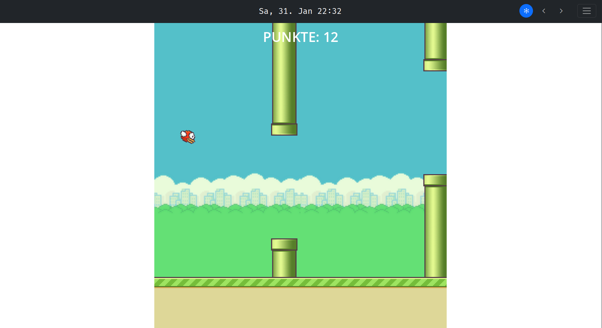
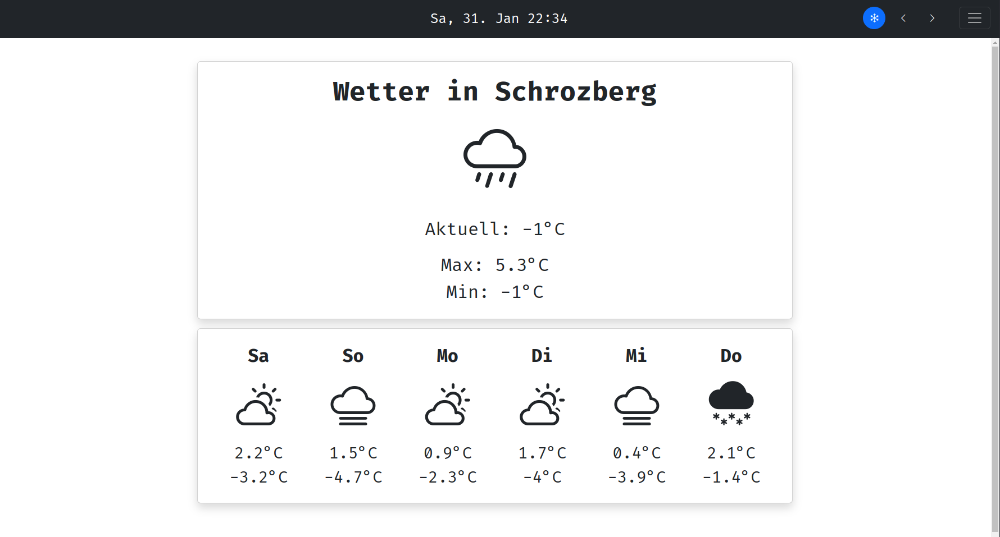
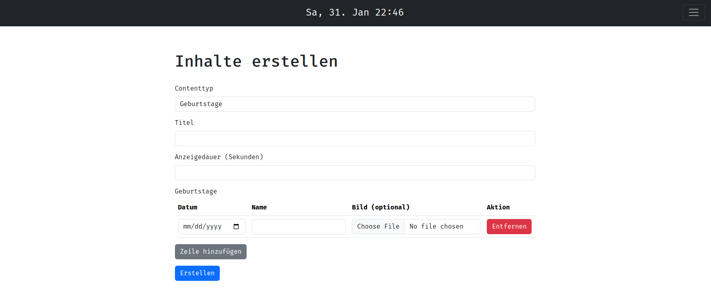
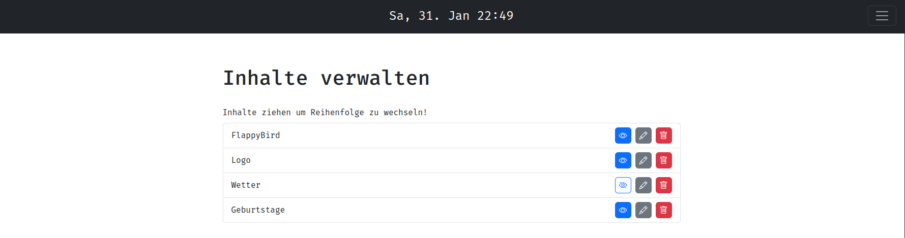

> [!NOTE]  
> Currently only German locale is implemented.

# Description

This project is meant to be displayed at places like kiosks or retirement homes.
Implemented content types are:
- Rich Text
- Image
- Rich Text + Image
- Video
- Slideshow
- PDF
- Excel
- Schedule
- Birthdays
- Weather
- News
- Game

Implemented motion tracking features are:
- play games
- skip / rewind content
- freeze content

#### Flappy Bird being played with gestures


#### Weather content


#### Content creation


#### Content management


# Project setup

> [!NOTE]  
> While this project works on every OS the Install.sh script won't and is currently only supported by Linux.
> The setting of a static ip as well as autostarting the browser was only tested and will most likely only work on the Raspberry PI, this depends on your network- and package manager (NetworkManager and apt used here).

1. Clone repository and execute Install.sh script
```
git clone git@github.com:CappedMonke/InfoDisplay.git
cd InfoDisplay
bash Install.sh
```
2. Follow the instructions
3. Enjoy

> [!WARNING]
> To prevent undefined behaviour run Uninstall.sh before running Install.sh for the second time.
